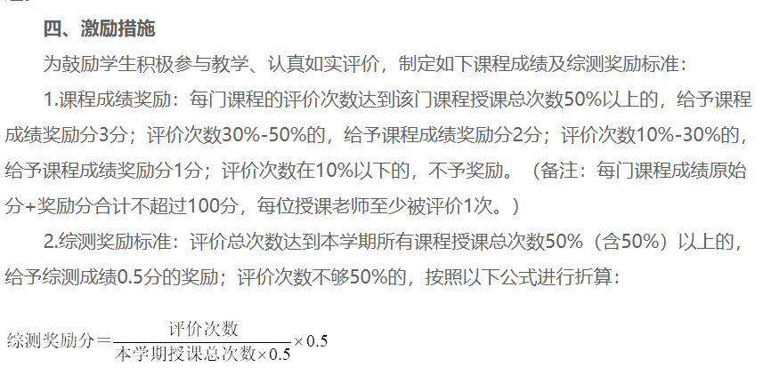

<!--
 * @File: 
 * @Project: 
 * @Author: zzy
 * @mail: elliot.bia.8989@outlook.com
 * @github: https://github.com/elliot-bia
 * @Date: 2019-10-17 10:55:22
 * @LastEditors: zzy
 * @LastEditTime: 2019-10-23 16:28:59
 -->
# 00 God Dam Fuck SMU Evaluation
随堂评价居然需要每日评价  
**重点是评价数超过50%的加3分**  
这大概就是这破学校最后的挣扎了, 虽然我不甚好学

为了3分的成绩, 我是如此的不务正业

# 01 支持特性:  
- 1/3的概率出现95分评价, 躲避教务系统追踪, 1/9概率出现90分评价
- 自定义主观题评价内容, 随机抽取, 同上是为了躲避系统追踪
- 打包exe文件, 去除python环境依赖

# 02 后续升级计划:  
- 深度学习验证码自动识别, 跳过登录操作
- 升级为数据库存储, 支持多人
- 自动化多人操作
- 增加cookie存活检测, 若失效自动登录

简单来说升级了给个账号密码就可以后顾无忧, 每天自动跑脚本, 不用管  
毕竟生命宝贵

懒咯, 升级计划待定

# 非常感谢前辈 @Aster-the-Med-Stu
代码参考 [Aster-the-Med-Stu](https://github.com/Aster-the-Med-Stu) 前辈的 [Fuck-SMU-Evaluation项目](https://github.com/Aster-the-Med-Stu/Fuck-SMU-Evaluation)  
由于系统有所升级, 所以进行调试优化  
大部分代码重构重写

# 使用说明
Mac需打开Safari的开发者选项：  
Safari浏览器-偏好设置-高级-在菜单栏中显示“开发”菜单  
开发-允许远程自动化

# 更新
## 2021.10.19
收到 [Jayce-H](https://github.com/Jayce-H) 的merge请求, 简单看了一下,没啥问题, 我已经毕业了,这个也无法验证, 感谢热心的学弟  
更新内容[在这](https://github.com/Jayce-H/God_Dam_Fuck_SMU_Evaluation/commit/eaa36afa71789c1a2429124f7627840e15e92ec4)  

__V3.5.4 2021-11.28更新内容：__  
1、更新登录页面判定机制，减少不必要的等待时间
通过判定当前页面url，登录后页面跳转既完成判定
登陆成功后url会跳转为http://zhjw.smu.edu.cn/login!welcome.action
不为原来的http://zhjw.smu.edu.cn/

__V3.5.3 2021-11.01更新内容：__   
1、优化日志输出：评价完成后再次获取当日评价目录，用于日志输出检查是否还有未评价课程

__V3.5.2 2021-10.19更新内容：__   
1、可自定义百度OCR相关设置APP_ID API_KEY SECRET_KEY  
默认识别模式为：高精度文字识别模式，不可更改！  
需手动在配置文件中添加[AipOcr]项，如下：  
[AipOcr]  
APP_ID=  
API_KEY=  
SECRET_KEY=

__V3.5 2021-10.18更新内容：__   
1.适配Mac，修复无法读取location的bug  
已知问题：mac可能会出现无法crop图片的错误，待完善

__V3.4 2021-10.17更新内容：__   
1.新增自定义评价分数  
可通过修改配置文件自定义想评价的分数  

__V3.3 2021-10.17更新内容：__  
1.新增日志输出开关  
2.基础代码变更  
Mac上无法使用以下命令driver.find_element_by_id(element)  
driver.find_element_by_class_name(element)  
全部替换为:  
driver.find_element(By.ID,element)  
driver.find_element(By.CLASS_NAME,element)  
4.由于win系统DPI缩放问题，导致截取验证码失败  
配置文件添加DPI项，保证验证码截图正确

__V3.2 2021-10.15更新内容：__  
1.输出日志每行开头添加时间戳  
代码中所有 print(a,b)格式 调整为 print(str(a) + str(b))格式  
2.判断操作系统决定浏览器  
Windows为Edge，Mac为Safari，Linux为Chrome  
3.添加验证码OCR识别并填入，采用百度免费OCR  
识别错误会自动重新识别填入，直至正确为止

__V3.1 2021-10.06更新内容：__  
1.读取本地配置，自动填入学号密码，缩短等待时间

__V3.0 2021-09.17更新内容：__  
1.新增筛选当日未评价课程，避免重复post  
2.删除了问题类型3随机选取文本的功能，改为跳过不填  
3.更新了部分参数，原参数已不再适用  
4.随机评分从5星4星更改为4星3星，最高得分从100分更改为80分 
